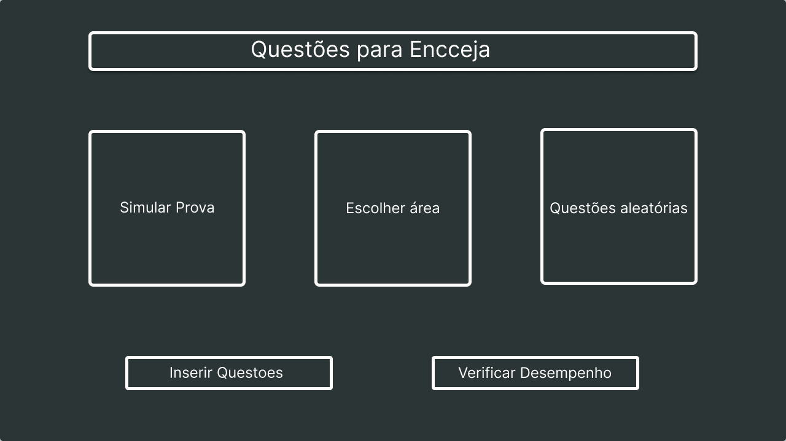
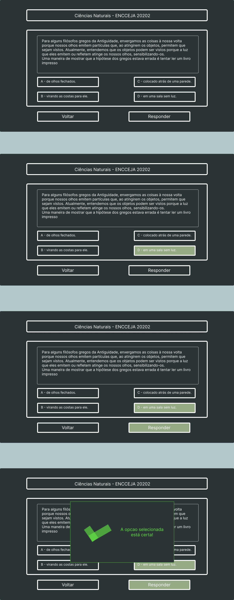
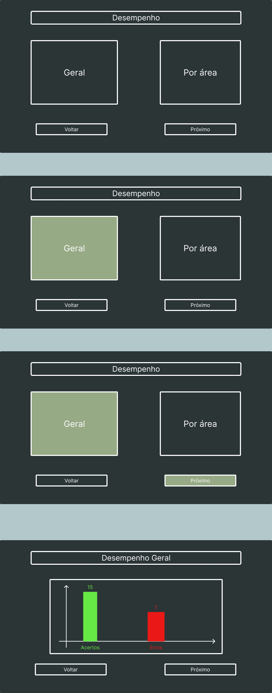

  

### **Disciplina:** Programação Web III
### **Turma:** Noite
### **Professora:** Silvia Bertagnolli
### **Aluno:** Alexandre de Mesquita Fabian
***  
## **TRABALHO PRÁTICO**
***  
### 1. Faça um pequeno resumo do aplicativo que você pretende desenvolver, deixando claro qual é o objetivo do seu app.

>### **Encceja para Android TV**  
>O Usuário deverá ser capaz:  
>* Iniciar o aplicativo;
>* Escolher uma das opcões entre: Treinar questões, Simular Prova e Incluir questões
>    * Treinar questões:
>        * Escolher área
>        * Questões aleatórias
>        * Verificar Resultado
>    * Simular Prova:
>        * Realizar provas por áreas, com contagem de tempo.
>        * Ao final, verificar aprovação
>    * Apresentar Temas de Redação
>    * Incluir novas questões:
>        * Algum tipo de autenticação (talvez um token em QRCode)
>        * Link para inclusão em outro meio (smartphone ou pc)  

[Link](https://github.com/amfabian/encceja-questions-app-for-android-tv/blob/main/docs/Requisitos.md) para o documento de requisitos.

***  
### 2. Elabore o diagrama de casos de uso relativo às funcionalidades previstas para o seu aplicativo. Coloque todas as funcionalidades pensadas, caso ele fique muito grande será possível restringir posteriormente.  

   

 [Link](https://github.com/amfabian/encceja-questions-app-for-android-tv/blob/main/docs/Casos%20de%20Uso.png) para o diagrama de casos de uso.

*** 

### 3. Faça o protótipo das telas de seu app usando (no mínimo 8 telas) – você DEVE usar uma ferramenta de prototipação de telas (https://www.figma.com/).  

 
> ### Tela Incial do App:  
 
   

   
> ### Tela para Escolher Área do App:
 
   

 
> ### Tela para Responder Questões do App:
 
   

> ###  Tela para Visualizar Desempenho do App:

     
 

[Link](https://www.figma.com/file/NeSMgWs1CXOje2p695qLMj/Encceja-app?node-id=0%3A1) para o protótipo no Figma.

